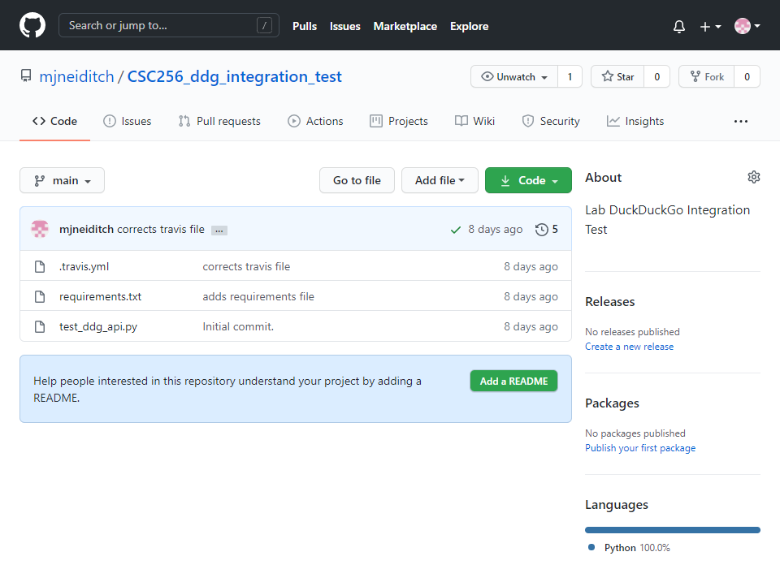

DuckDuckGo Integration Test

A PyTest module that queries the DuckDuckGo api for “presidents of the united states,” and 
tests that each president is listed in the response.
Implements Travis for continuous integraiton.

